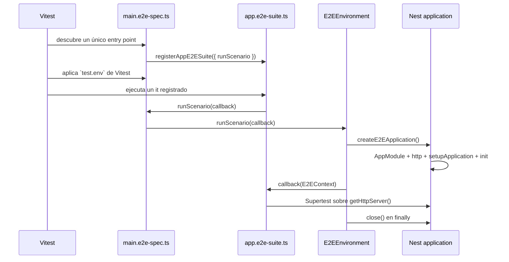

# Diseño técnico: base extensible de pruebas E2E

## Resumen de la decisión

Vitest descubrirá exclusivamente `test/main.e2e-spec.ts` mediante `vitest.config.e2e.ts`. Ese
archivo será el único propietario del entorno E2E y registrará, en orden explícito, suites con
sufijo `*.e2e-suite.ts`. Las suites importadas declararán casos y aserciones, pero recibirán una
función `runScenario` del propietario; no crearán hooks globales ni administrarán aplicaciones o
`process.env`.

Cada invocación de `runScenario` creará un `E2EContext` nuevo desde `AppModule`, aplicará
`setupApplication` con la configuración tipada `http`, ejecutará el escenario contra el servidor
HTTP y cerrará la aplicación en un bloque de limpieza. `vitest.config.e2e.ts` define, mediante
`test.env`, `CORS_ORIGINS=https://allowed.example`, `THROTTLE_LIMIT=2` y `THROTTLE_TTL_SECONDS=60`;
el helper no lee, modifica ni restaura `process.env`.

La base no incorpora persistencia, autenticación, fixtures, seeds ni adapters externos. Esos
recursos se añadirán al mismo propietario cuando exista una capacidad real que los requiera.

## Objetivos y límites

### Objetivos

- Hacer inequívocos el descubrimiento, el registro y la propiedad del lifecycle E2E.
- Preservar los cuatro contratos HTTP actuales y su ejecución una sola vez.
- Conservar una aplicación nueva por escenario independiente, incluido el estado nuevo del
  throttler.
- Derivar el runtime E2E del ensamblado de producción sin cambiar `src/main.ts` ni el contrato
  público.
- Garantizar limpieza determinista en rutas correctas y fallos parciales.
- Dejar una convención mínima y extensible sin crear interfaces para capacidades inexistentes.

### Fuera de alcance

- PostgreSQL, Prisma, migrations, autenticación, nuevos módulos de dominio, fixtures o seeds.
- Test doubles de componentes internos o adapters externos que todavía no existen.
- Un módulo Nest exclusivo para testing, propietarios E2E adicionales o ejecución concurrente.
- Cambios en endpoints, CORS, Helmet, throttling o bootstrap de producción.
- Creación de tasks, implementación, commits o cambios de dependencias.

## Estructura propuesta

```text
vitest.config.e2e.ts
openspec/config.yaml
docs/testing/e2e-testing.md
test/
├── main.e2e-spec.ts
├── modules/
│   └── app/
│       └── app.e2e-suite.ts
└── support/
    ├── create-e2e-application.ts
    ├── e2e-context.ts
    └── e2e-environment.ts
```

| Archivo                                  | Acción posterior          | Responsabilidad                                                                                                            |
| ---------------------------------------- | ------------------------- | -------------------------------------------------------------------------------------------------------------------------- |
| `vitest.config.e2e.ts`                   | Editar                    | Cambiar `include` a `['test/main.e2e-spec.ts']`; conservar Vitest, SWC, aliases y el entorno actual.                       |
| `test/main.e2e-spec.ts`                  | Crear                     | Único entry point; crear y disponer el entorno; construir `runScenario`; registrar suites en orden visible.                |
| `test/modules/app/app.e2e-suite.ts`      | Crear                     | Registrar los cuatro escenarios HTTP existentes mediante la API recibida; contener únicamente casos y aserciones públicas. |
| `test/support/e2e-context.ts`            | Crear                     | Declarar `E2EContext` y los tipos de callback de registro/ejecución compartidos.                                           |
| `test/support/create-e2e-application.ts` | Crear                     | Compilar `AppModule`, crear e inicializar Nest, obtener `http`, aplicar `setupApplication` y limpiar bootstrap parcial.    |
| `test/support/e2e-environment.ts`        | Editar                    | Ofrecer ejecución por escenario con limpieza determinista sin acceder a `process.env`.                                     |
| `test/app.e2e-spec.ts`                   | Eliminar después de mover | Evitar el owner anterior y la duplicación; sus cuatro escenarios pasan sin cambio de intención a `app.e2e-suite.ts`.       |
| `docs/testing/e2e-testing.md`            | Editar                    | Documentar la convención concreta, el flujo vigente y las extensiones futuras claramente no implementadas.                 |
| `openspec/config.yaml`                   | Editar                    | Sustituir Playwright por `Vitest` y conservar `pnpm run test:e2e` como comando E2E oficial.                                |

No se propone modificar `src/main.ts`, `src/app.module.ts`, `src/app.setup.ts`, `package.json` ni
`vitest.config.ts`. El patrón unitario amplio de `vitest.config.ts` ya puede coincidir con archivos
`*.e2e-spec.ts`. Durante la revisión del diseño se decidió explícitamente mantener esta separación
fuera del alcance y tratarla en un cambio posterior; no es necesaria para satisfacer el
descubrimiento de la configuración E2E de esta especificación.

## Contratos TypeScript

### Contexto y registro

Los contratos mínimos previstos son equivalentes a los siguientes; los nombres concretos forman
parte del diseño, pero el código es ilustrativo:

```typescript
import type { INestApplication } from '@nestjs/common';

export type E2EContext = Readonly<{
  app: INestApplication;
}>;

export type E2EScenario = (context: E2EContext) => Promise<void>;

export type RunE2EScenario = (scenario: E2EScenario) => Promise<void>;

export type E2ESuiteRegistration = Readonly<{
  runScenario: RunE2EScenario;
}>;
```

`E2EContext` contiene solo `app`: Supertest obtiene el servidor real con
`context.app.getHttpServer()`. No se duplica ese valor en el contexto mientras no tenga ownership o
lifecycle independiente.

Cada módulo exportará una función con nombre de feature:

```typescript
export function registerAppE2ESuite(registration: E2ESuiteRegistration): void;
```

La función registra `describe` e `it` sin hooks. Cada `it` llama a
`registration.runScenario(async ({ app }) => { ... })`. Por tanto, la suite puede definir el
escenario, pero no puede abrir o cerrar la aplicación ni mutar el entorno por medio de la API
pública.

`main.e2e-spec.ts` importará y llamará las funciones en orden legible:

```typescript
registerAppE2ESuite({ runScenario });
// Futuro: registerAuthE2ESuite({ runScenario });
```

No se usará un array dinámico de registradores: las llamadas explícitas producen un diff y un orden
de revisión más claros.

### Aplicación derivada de producción

`createE2EApplication(): Promise<E2EContext>` tendrá esta secuencia:

1. Compilar un `TestingModule` que importe `AppModule`.
2. Crear `INestApplication` con el adapter Express configurado por Nest.
3. Obtener `app.get<ConfigType<typeof httpConfig>>(httpConfig.KEY)`.
4. Ejecutar `setupApplication(app, config)`.
5. Ejecutar `await app.init()`.
6. Devolver `{ app }` únicamente después de una inicialización completa.

El helper usará `import type` para `INestApplication`, `ConfigType` y tipos locales. No llamará a
`listen`: Supertest usa `app.getHttpServer()` y ejercita el adapter HTTP real inicializado. Tampoco
replicará manualmente Helmet, CORS, trust proxy o throttling.

Si existe una aplicación cuando `setupApplication` o `app.init()` falla, el helper intentará
`app.close()` antes de propagar el fallo. Un error de limpieza no ocultará el error original: se
reportarán ambos mediante un `AggregateError` cuyo primer elemento sea el error original. Si la
compilación falla antes de exponer un recurso cerrable, se propagará ese error sin simular cleanup.

### Entorno acotado

`vitest.config.e2e.ts` es el único propietario de los valores E2E y define mediante `test.env`:

- `CORS_ORIGINS=https://allowed.example`;
- `THROTTLE_LIMIT=2`;
- `THROTTLE_TTL_SECONDS=60`.

`createE2EEnvironment()` no es un editor de `process.env` y no requiere `dispose`. Su única
operación es:

```typescript
export type E2EEnvironment = Readonly<{
  runScenario: RunE2EScenario;
}>;
```

`runScenario` crea un contexto nuevo, ejecuta el callback y cierra `context.app`. Si el escenario y
el cierre fallan, conserva ambos mediante `AggregateError`, con el fallo del escenario primero.
Vitest aplica los valores configurados al contexto E2E sin que el helper lea, modifique o restaure
el environment del proceso.

## Propiedad del lifecycle

`main.e2e-spec.ts` mantendrá una referencia privada al `E2EEnvironment` dentro de su módulo y será
el único archivo con hooks globales:

- `beforeAll`: llama a `createE2EEnvironment()`;
- no requiere `afterAll`: cada escenario cierra su propia aplicación y el helper no posee recursos
  compartidos;
- `runScenario`: comprueba que el entorno está inicializado y delega en
  `environment.runScenario(scenario)`.

El cierre por escenario pertenece al owner a través de `runScenario`, no al archivo importado. Así
se obtiene una aplicación nueva sin conceder lifecycle hooks a las suites.



Para cada uno de los cuatro `it`, el tramo `createE2EApplication`/`close` se repite. Ningún
escenario consume datos o estado del anterior. El orden explícito de registro es revisable, pero no
constituye una dependencia de ejecución.

## Flujos de fallo y cleanup

### Bootstrap parcial de escenario

```text
compile AppModule
  ├─ falla antes de app -> propagar error original
  └─ crea app
      ├─ setup/init correcto -> ejecutar escenario -> close
      └─ setup/init falla -> intentar close -> propagar original (+ cleanup si falla)
```

### Configuración del entorno

```text
vitest.config.e2e.ts -> test.env -> contexto E2E -> AppModule
```

Vitest aplica los valores configurados; el helper no lee, modifica ni restaura `process.env`.

### Precedencia de errores

La limpieza siempre se intenta. Cuando trabajo y cleanup fallan, `AggregateError` mantiene el error
de trabajo como primer elemento y añade los fallos de limpieza; nunca reemplaza silenciosamente el
fallo que inició la ruta. No se usa terminación forzada.

## Alternativas y tradeoffs

### Forma de la API de registro

| Alternativa                             | Ventaja                                                                                             | Costo o riesgo                                                          | Decisión      |
| --------------------------------------- | --------------------------------------------------------------------------------------------------- | ----------------------------------------------------------------------- | ------------- |
| `registerFeatureSuite({ runScenario })` | Capacidad mínima explícita; dificulta apropiarse del lifecycle; fácil de extender de forma aditiva. | La indirección añade una función por caso.                              | Seleccionada. |
| Pasar `E2EEnvironment` completo         | Menos wiring.                                                                                       | Expone capacidades de lifecycle innecesarias a una suite.               | Rechazada.    |
| Pasar `getContext()`                    | Cómodo para assertions.                                                                             | Oculta quién crea/cierra la app y facilita fugas o contexto compartido. | Rechazada.    |
| Importar módulos solo por side effect   | Muy breve.                                                                                          | El orden y las dependencias quedan implícitos; dificulta revisión.      | Rechazada.    |

### Aplicación por escenario frente a aplicación compartida

| Alternativa                     | Ventaja                                                                 | Costo o riesgo                                                       | Decisión                                            |
| ------------------------------- | ----------------------------------------------------------------------- | -------------------------------------------------------------------- | --------------------------------------------------- |
| Aplicación nueva por escenario  | Aísla throttling y estado in-process; permite reordenar; cleanup local. | Mayor tiempo de compilación e inicialización.                        | Seleccionada por requisito y comportamiento actual. |
| Una aplicación por suite        | Ejecución más rápida.                                                   | Filtra throttling y futuro estado mutable; exigiría resets probados. | Rechazada ahora.                                    |
| Aplicación global para todo E2E | Menor costo de bootstrap.                                               | Máximo acoplamiento y una interpretación incorrecta del owner único. | Rechazada.                                          |

Si el costo futuro resulta material, solo podrá compartirse la aplicación después de diseñar y
probar resets deterministas para todas las capacidades afectadas; no se optimiza por anticipado.

### Diseño del ejecutor de escenarios

| Alternativa                              | Ventaja                                                          | Costo o riesgo                                                   | Decisión      |
| ---------------------------------------- | ---------------------------------------------------------------- | ---------------------------------------------------------------- | ------------- |
| Ejecutor específico sin argumentos       | Superficie acotada y auditable; solo crea y cierra aplicaciones. | Una nueva capacidad exige editar el owner.                       | Seleccionada. |
| Helper genérico `Record<string, string>` | Reutilizable.                                                    | Convertiría suites en mutadoras potenciales de configuración.    | Rechazada.    |
| Mutar y restaurar `process.env`          | Parece independiente del runner.                                 | Introduce estado global y contradice el ownership de `test.env`. | Rechazada.    |
| `vi.stubEnv` desde suites                | Integración con Vitest.                                          | Distribuye el ownership de configuración entre suites.           | Rechazada.    |

### Nomenclatura y descubrimiento

Se selecciona `test/main.e2e-spec.ts` como único nombre descubierto y `*.e2e-suite.ts` bajo
`test/modules/<feature>/` para registros importados. El sufijo distingue entry point de suite por
reconocimiento visual y la configuración exacta evita depender solo de exclusiones glob.

Se rechaza mantener `**/*.e2e-spec.ts`, porque permite owners accidentales y doble ejecución.
También se rechaza ocultar suites importadas bajo nombres genéricos `*.ts`, porque reduce la
capacidad de búsqueda y revisión.

### Extensiones futuras sin interfaces prematuras

- **PostgreSQL y Prisma:** cuando existan, `E2EEnvironment` adquirirá creación de una base temporal
  exclusiva, validación fail-closed de la URL administrativa E2E, migrations versionadas y
  eliminación posterior. La aplicación seguirá creándose desde el production persistence path. No se
  crea hoy `DatabaseHarness`.
- **Autenticación:** las suites usarán registro/login HTTP. Solo un business flow realmente ordenado
  añadirá un contexto tipado propio de feature; no se agregan tokens ni helpers vacíos ahora.
- **External adapters:** el owner centralizará un override únicamente del token DI que cruza fuera
  del proceso y expondrá su captura mediante una capacidad concreta. No se diseña hoy un registry
  genérico de mocks.
- **Fixtures y seeds:** se agregarán factories frescas cuando haya payloads repetidos. Los
  prerequisites se crearán por HTTP; un seed directo requerirá una justificación mínima y
  persistencia real.

Estas extensiones amplían el owner por necesidad concreta. Primero se introduce el recurso y su
cleanup; después, si más de una capacidad real comparte una forma estable, se evalúa extraer una
interfaz.

## Conservación de contratos HTTP

`app.e2e-suite.ts` trasladará sin cambiar su intención:

1. `GET /` responde `200`, `Hello World!`, `x-content-type-options: nosniff` y
   `x-frame-options: SAMEORIGIN`.
2. El origen permitido obtiene `access-control-allow-origin` sin credentials; el origen no
   configurado no obtiene esa cabecera.
3. `OPTIONS /` permitido responde `204` y conserva la cabecera CORS.
4. Tres `GET /` con límite dos responden `200`, `200`, `429` dentro del mismo contexto de escenario.

Solo el cuarto caso comparte deliberadamente el estado de su propia aplicación entre tres requests.
No comparte estado con otro `it`.

## Trazabilidad con la especificación

| Requirement                                              | Decisiones que lo satisfacen                                                                                    | Evidencia de verificación posterior                                       |
| -------------------------------------------------------- | --------------------------------------------------------------------------------------------------------------- | ------------------------------------------------------------------------- |
| Propietario único descubierto por Vitest                 | `include: ['test/main.e2e-spec.ts']`; solo `main` usa hooks; app por escenario dentro del owner.                | Reporter de `pnpm run test:e2e` muestra un archivo y cuatro casos.        |
| Registro explícito de suites no descubribles             | `registerAppE2ESuite({ runScenario })`; llamadas explícitas; sufijo `*.e2e-suite.ts`; suites sin hooks.         | Inspección/configuración y ejecución única de los casos.                  |
| Aplicación nueva por escenario independiente             | `runScenario` crea y cierra un contexto en cada `it`; no hay contexto mutable global de feature.                | Spy/fallo inicial de prueba del harness y caso de throttling reordenable. |
| Bootstrap E2E derivado de producción                     | `AppModule`, `ConfigType<typeof httpConfig>`, `httpConfig.KEY`, `setupApplication`, `app.init`, Supertest.      | Los cuatro contratos HTTP pasan sobre `getHttpServer()`.                  |
| Configuración E2E acotada por Vitest                     | `test.env` con tres valores explícitos; helper sin acceso a `process.env`.                                      | Prueba enfocada sin mutación y E2E con valores externos conflictivos.     |
| Conservación de cuatro escenarios HTTP                   | Traslado de las assertions actuales a `app.e2e-suite.ts`.                                                       | Cuatro casos verdes con los mismos status, body y headers.                |
| Puntos de extensión futuros sin abstracciones prematuras | Actualización documental y ausencia de helpers/interfaces de DB, auth o adapters.                               | Revisión de archivos y dependencias; documentación separa actual/futuro.  |
| Corrección de metadatos OpenSpec                         | `openspec/config.yaml` declara `Vitest` y `pnpm run test:e2e`.                                                  | Inspección de configuración y comando real de paquete.                    |
| Documentación de la convención concreta                  | `docs/testing/e2e-testing.md` explica entry point, sufijo, registro, lifecycle, bootstrap, entorno y extensión. | Revisión cruzada con estructura, config y comando.                        |

## Implicaciones de strict TDD para apply

`openspec/config.yaml` exige `strict_tdd: true`. La fase de implementación deberá separar cambios de
comportamiento en ciclos red-green-refactor y conservar evidencia de cada fallo esperado antes de
producir el código correspondiente.

Orden recomendado para una fase posterior, sin constituir tasks de este cambio:

1. Crear primero pruebas enfocadas del entorno para presencia/ausencia, alcance de claves,
   idempotencia, fallo parcial y precedencia de errores; confirmar red.
2. Crear pruebas enfocadas del runner de escenario para aplicación nueva y cierre en éxito/fallo;
   confirmar red.
3. Restringir discovery y registrar temporalmente la suite trasladada; confirmar que el nuevo
   contrato de entry point falla antes de completar el wiring.
4. Implementar el soporte mínimo hasta verde, trasladar las assertions existentes sin relajarlas y
   refactorizar solo después.

Las pruebas de helpers podrían ubicarse como `test/support/*.spec.ts` para ser descubiertas por
`vitest.config.ts`; deben comprobar que la construcción y ejecución no cambien las tres claves
controladas, sin mutar directamente `process.env`. Los errores de bootstrap pueden probarse con
factories internas inyectables solo si esa seam es necesaria para producir el fallo; no debe
convertirse en una interfaz pública ni reemplazar componentes de la aplicación en las pruebas E2E.

## Estrategia de verificación posterior

La implementación se considerará verificable con esta secuencia:

```bash
pnpm exec vitest run test/support --config ./vitest.config.ts
pnpm run test:e2e
pnpm test
pnpm run lint
pnpm exec prettier --check openspec/changes/establish-e2e-test-foundation/design.md docs/testing/e2e-testing.md
pnpm exec markdownlint-cli2 openspec/changes/establish-e2e-test-foundation/design.md docs/testing/e2e-testing.md
```

Además de resultados verdes, la revisión debe comprobar:

- un único archivo reportado por la ejecución E2E y exactamente cuatro escenarios baseline;
- ausencia de hooks en `*.e2e-suite.ts`;
- una instancia distinta de aplicación por `it` y cierre también cuando el callback falla;
- valores de `test.env` que prevalecen sobre valores externos conflictivos;
- ausencia de handles abiertos y de terminación forzada;
- ausencia de nuevas dependencias o abstracciones de capacidades futuras;
- alineación entre `package.json`, `vitest.config.e2e.ts`, `openspec/config.yaml` y documentación.

La primera orden enfocada es orientativa: Vitest debe confirmar el patrón concreto de archivos al
implementarse. Si el filtro posicional no selecciona esos tests en Vitest 5, se usará el comando
soportado por la configuración sin saltarse sus hooks de cleanup.

## Rollout y rollback

El rollout es atómico respecto del descubrimiento: crear primero el nuevo owner y la suite
importada, y cambiar `include` junto con la eliminación de `test/app.e2e-spec.ts`. No debe existir
un estado final con ambos owners descubiertos ni un cambio de patrón sin suite registrada.

El rollback técnico restaura `include: ['**/*.e2e-spec.ts']` y `test/app.e2e-spec.ts`, y elimina los
nuevos archivos bajo `test/support/`, `test/modules/` y `test/main.e2e-spec.ts`. La corrección de
Vitest en `openspec/config.yaml` no debe revertirse mientras siga reflejando el runner real. No hay
migración de datos ni compatibilidad de API que deshacer.

## Carga de revisión y partición

El cambio cruza configuración, harness, traslado de pruebas y documentación. Antes de apply debe
estimarse el diff contra el presupuesto canónico de 400 líneas. Si la implementación supera o
amenaza ese límite, la estrategia `ask-on-risk` exige pausar para que la persona elija partición o
acepte explícitamente otra estrategia; este diseño no infiere chaining ni `size:exception`.

Una revisión debe comenzar por `vitest.config.e2e.ts` y `test/main.e2e-spec.ts`, seguir por
`test/support/`, comprobar después el traslado sin cambios de contrato en `app.e2e-suite.ts` y
terminar con la alineación documental. Tests y documentación deben permanecer junto al código cuya
decisión verifican en cualquier partición futura.

## Riesgos residuales

| Riesgo                                                                 | Mitigación o control                                                                                  |
| ---------------------------------------------------------------------- | ----------------------------------------------------------------------------------------------------- |
| El bootstrap por escenario aumenta el tiempo E2E.                      | Medir antes de optimizar; preservar aislamiento hasta disponer de resets demostrables.                |
| Una suite usa hooks pese a la convención.                              | API mínima, sufijo explícito, documentación y revisión estática; no se añade linter custom prematuro. |
| Cleanup secundario oculta un fallo primario.                           | Agregar errores manteniendo el original en primera posición.                                          |
| Una nueva variable E2E queda sin configuración explícita.              | `test.env` revisable en la configuración E2E.                                                         |
| `pnpm test` también descubre `main.e2e-spec.ts` por su glob existente. | Riesgo preexistente documentado; decidir por separado si se excluye E2E de la configuración unitaria. |
| Futuras DB o integraciones fuerzan un rediseño.                        | Extender el owner desde recursos concretos y extraer interfaces solo tras repetición real.            |
